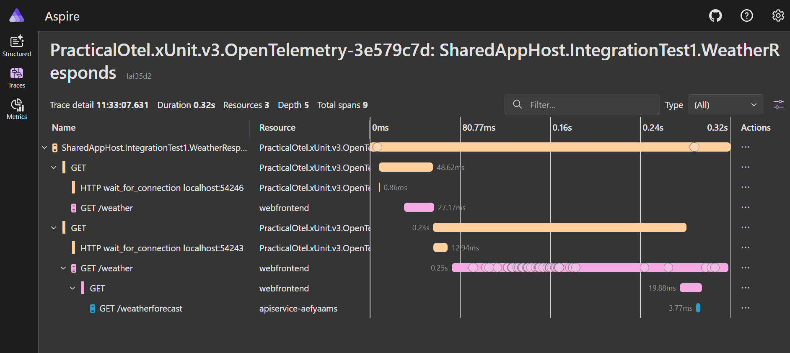
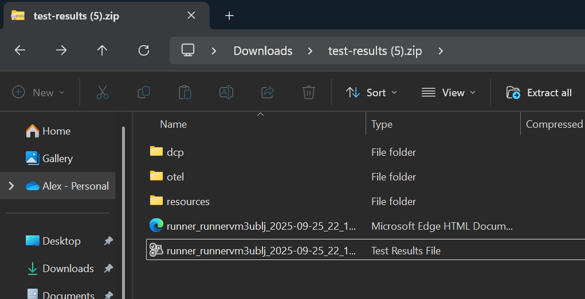
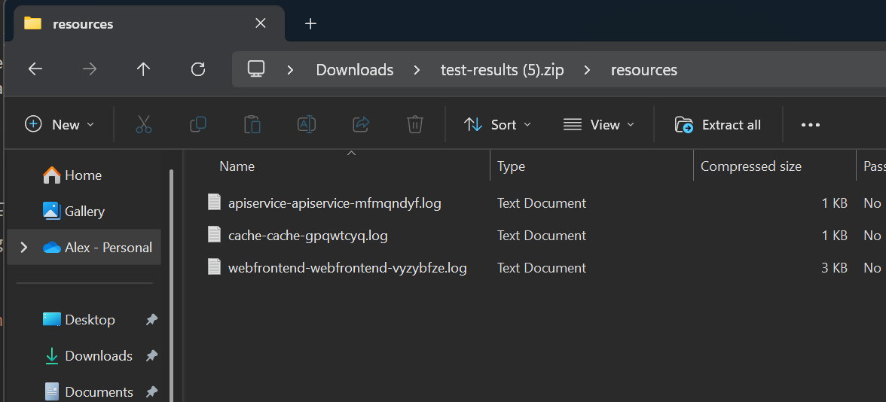
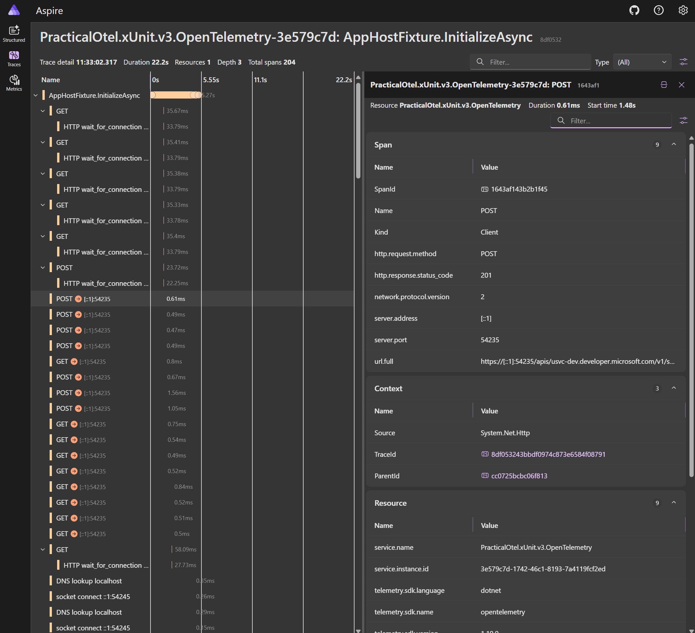

This is a spike around improving the ability to troubleshoot `DistributedApplicationTestingBuilder` failures, particularly around CI.

It's very proof of concepty right now, so has several rough edges, but the core ideas work well enough to prove the idea out.

# 🏃‍♂️ Running

1. Run `.\Run-AspireDashboard.ps1` to start an aspire dashboard.
2. Run `.\Run-OtelCollector.ps1` to start an otel collector.  This is used to write otel to a file (`.\TestResults\otel\otel.json`).
3. Run the tests - either via `dotnet test` or your IDE.

(So far I've only tested this with .Net 10 and MTP)

# ℹ️ What this spike does

## 📊 Otel for Traces

Each test gets it's own span, which propagates down through the tests.  You can then view the test end to end in a single span.

This solves some of the correlation & parallelisation issues you have with using `DistributedApplicationTestingBuilder` and emitting your resource logs via stdout in tests (as long as your resources support otel and propagation)

The  traces per test xunit integration is heavily based on https://docs.honeycomb.io/send-data/logs/collector/ , with some custom OTel logging configuration on `DistributedApplicationTestingBuilder` to send the app host's logs to the same otel instance.

(See `PipelineStartup.cs` and `DistributedApplicationBuilderExtensions.WithOtel()`)

## CI Logs

A single artifact is produced from CI which contains
- DCP Logs
- Resource logs (stdout/err)
- Otel (from Otel Collector [File Exporter](https://github.com/open-telemetry/opentelemetry-collector-contrib/blob/main/exporter/fileexporter/README.md))

The resource logs are particularly important when reusing an apphost across multiple tests - if the apphost is spun up in a global context, outside of an individual test, test framework often won't record the logs anywhere in the test result file for you to see.

### 📊 Getting Otel out of CI

To get Otel out of CI, I use the otel collector with a [file exporter](https://github.com/open-telemetry/opentelemetry-collector-contrib/blob/main/exporter/fileexporter/README.md).

To view this locally, you'll need to use something like the OTel Collector's [JSON File Receiver](https://github.com/open-telemetry/opentelemetry-collector-contrib/blob/main/receiver/otlpjsonfilereceiver/README.md) to rehydrate the otel into a tool (e.g. aspire dashboard)

A better solution through would be to send this to an external system (App Insights, Honeycomb etc.)

For now, I'm running the collector standalone outside of aspire as I wanted to ensure it was running before any tests run.
Although I may be ble to re-work this to use the Community Toolkit's Otel Collector - I just didn't want to worry about how to make sure I don't loose early telemetry at this point of a PoC.

In CI, the collector is before the tests run (see `Start Otel Collector` step in `.github\workflows\dotnet.yml`).
In local dev, this can be set up with `Run-AspireDashboard.ps1` and `Run-OtelCollector.ps1`

### 📃 Log resource output to file

(See `ResourceFileLogger`)

This writes stdout/err to one file per resource.  

When enabling this, I also suppress all logging from the `{builder.Environment.ApplicationName}.Resources` category as apps that log to both otel and stdout (as the `Web` and `ApiService` projects in the Aspire sample do by default),  end up with duplicated logs in the final destination (once from the app directly, and a second copy from the AppHost).

# 🧩 Challenges

## DCP Noise

The k8s api client the AppHost uses to communicate with 

You can somewhat mitigate this by wrapping the start within a dedicated activity, so all the k8s calls under that , but that does still make the startup portion of the trace very noisy.

I've tried to suppress these with `DcpNoiseScrubber` processor, but it's not fully working.

## stdout/err and Otel

At first it seems obvious to just send stdout/err to otel, but that causes a few problems

- For apps that support otel and also write their logs to stdout, you end up with log duplication in otel - the log 
- the logs get correlated with the AppHost resource than the resource they actually relate to, and also miss any other span/parent information for correlation into traces.

For now, I settled with writing these logs to files, which can be captured in CI artifacts, but I'm positive there is a better solution. 

